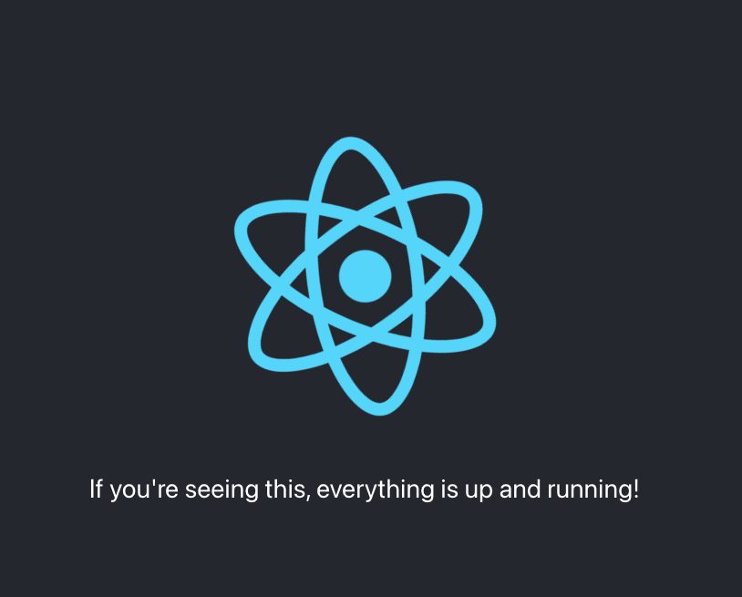

# Getting Started

Hello there! This repo is designed to ensure that you can access all fo the tools needed for a live coding interview. Before we meet, please be sure that the following requirements are met:

| Item           | Description | Time Required   | Relevant Links | 
|----------------|---------------|---------------|----------------|
| **A working IDE** | Use your IDE of choice. If you don't have one, an easy one to get started with is VS Code  | < 2 mins | [VS Code Download](https://code.visualstudio.com/) | 
|  **Node.js**   | Ensure you have Node.js installed on your machine. You can download and install it from the link provided  | < 2 mins | [Node JS](https://nodejs.org/) | 
| **npm**   | npm is a package manager for Node.js. It is usually installed automatically with Node.js. However, it's recommended to have a recent version of npm. You can update npm using the following command: `npm install -g npm@latest`| < 2 mins   | N/A |


## Installation

To set up the project, follow these steps:

1. Clone the repository to your local machine:

    ```sh
    git clone https://github.com/akerpelman-cohere/environment-setup-test-app.git
    ```
    a. Alternatively, you may download the zip file from the [github repo](https://github.com/akerpelman-cohere/environment-setup-test-app/)


2. Navigate to the project directory:

    ```sh
    cd environment-setup-test-app
    ```

3. Install dependencies using npm:

    ```sh
    npm install
    ```

## Usage

Once you have installed the dependencies, you can run the following command to start the development server:

```sh
npm start
```

Ensure no processes are running on port 3000 and then navigate to [localhost:3000](http://localhost:3000) if not automatically redirected.

If you see the following page you're ready to go. Happy coding! 